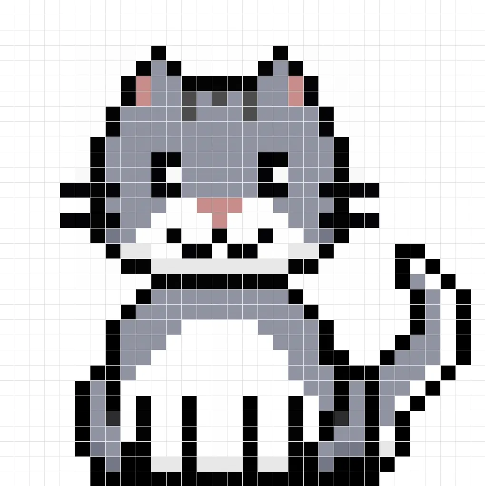

# Shaders: PixelArt de un Gato sobre un Fondo Animado

## Motivación

Este proyecto nace de dos inspiraciones principales:

1. **El gato:** Mi objetivo era crear un **gato pixelado** usando shaders y partí de una imagen de referencia (`gato_inspo.webp`), que me resultó bastante bonita. La idea era experimentar con **arte pixelado animado**, inspirado en los trabajos de [gela.js en Instagram](https://www.instagram.com/gela.js/), que muestra creaciones de arte pixelado mediante shaders. El resultado final es `gato_resultado.png`.

2. **El fondo:** Para el fondo, me inspiré en propuestas geométricas de **Victor Vasarely**, donde se usan **rejillas, celdas y rotaciones** para crear sensación de profundidad y movimiento. Partiendo de un ejemplo de rejilla rotada, utilicé esa inspiración para hacer un **Tiny Code** animado, con distorsiones sinusoidales y un patrón de fondo, adaptado para que **resalte el gato central** sin distraer demasiado.

---

## Desarrollo

### Fondo

* **Base:** Una rejilla de celdas tipo Vasarely con rotación dependiente del tiempo y la posición.
* **Animación:** Se añadieron distorsiones sinusoidales para crear un efecto de movimiento fluido.
* **Color:** Se eligieron colores distintivos (azul y rosa) y se combinó con un lienzo blanco cuadrado alrededor del gato para que la figura destaque.
* **Tiny Code:** La rejilla se simplificó a un patrón más ligero y eficiente, optimizado para ejecución en tiempo real.

```glsl
vec2 uv=gl_FragCoord.xy/u_resolution;
uv+=0.02*sin(uv*20.+u_time*4.);
vec2 g=fract(uv*10.);
float e=step(.1,g.x)*step(.1,g.y)*step(g.x,.9)*step(g.y,.9);
vec3 c=mix(vec3(0),vec3(g,1.),e);
gl_FragColor=vec4(c,1.);
```

* `uv` normaliza la posición del fragmento.
* Se aplica una **distorsión sinusoide temporal** para generar movimiento.
* `fract(uv*10.)` crea un patrón repetitivo de celdas.
* `step` define los bordes de cada celda, creando un patrón cuadriculado.
* `mix` combina el color de fondo con el de las celdas.

### Gato

**Inspiración:** La imagen original `gato_inspo.webp` y el estilo pixel-art inspirado en publicaciones de artistas de shaders. El gato se implementa como un **shader procedural por capas**, de la siguiente forma:

* **Círculo gris base (cara):** Se usa `length(p)` sobre un grid de píxeles para definir la circunferencia.
* **Mancha blanca en la barbilla:** Una condición adicional sobre el mismo círculo, para darle color.
* **Borde negro:** Condición que resalta el perímetro de la cara.
* **Bigotes:** Bucles que dibujan líneas horizontales a la altura de los bigotes, que sobresalen.
* **Ojos y brillo:** Círculos negros para la pupila y un pequeño círculo blanco desplazado para el reflejo, estilo anime.
* **Nariz y boca:** Círculos de color rosa y negro, respectivamente, con posiciones relativas a la cara.
* **Orejas:** Triángulos construidos con condiciones lineales sobre `uv` para simular forma de oreja.

**Notas de desarrollo:**

* Se emplea un **grid de píxeles (`pixelSize`)** para mantener consistencia en el estilo pixel-art.
* El gato se renderiza sobre un **lienzo blanco** que evita que el fondo sobresalga por la barbilla.
* La combinación con el fondo tiny code respeta la idea de mantener el shader **performante y legible**, separando fondo y sujeto principal.


---

### Integración

* El fondo se dibuja primero, con animaciones y distorsiones.
* Se coloca un lienzo blanco cuadrado alrededor del gato para mantener la integridad visual.
* Finalmente se dibuja el gato procedimentalmente, capa por capa, combinando gris, blanco, negro y rosa.

---

## Comparación visual

* | Referencia (`gato_inspo.webp`)  | Shader Resultante (`gato_resultado.png`) |
| ------------------------------- | ---------------------------------------- |
|  |    |

La intención fue mantener **la esencia y expresión del gato original**, pero transformarlo en un **estilo pixelado limpio y adaptable a animaciones**.

---

## Fuentes

* **Arte geométrico / Vasarely:** inspiración en patrones de celdas, rotación y repetición.
* **gela.js en Instagram:** inspiración en arte pixelado y shaders en Instagram.
